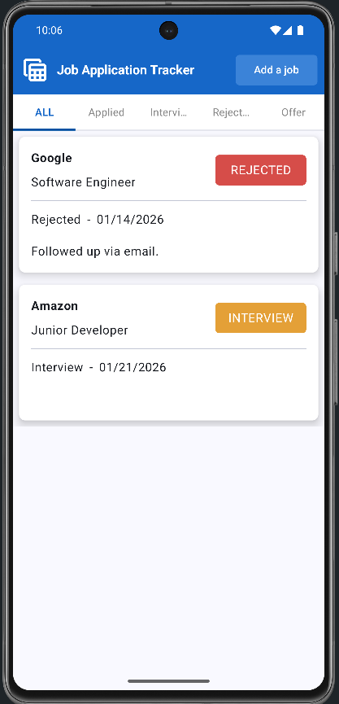
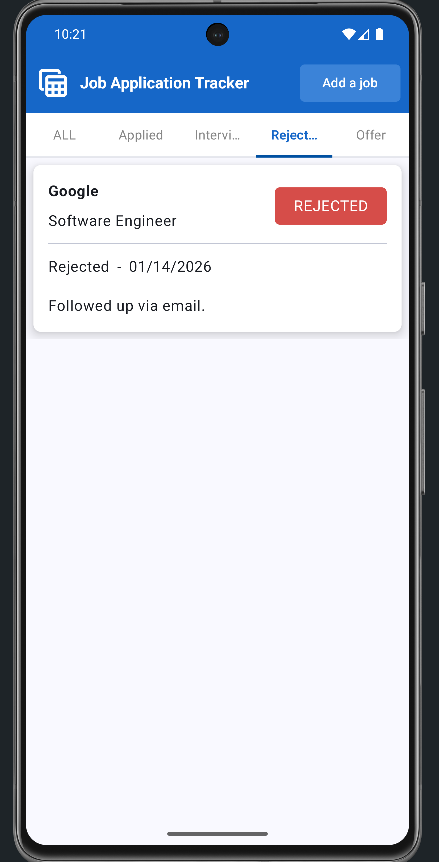
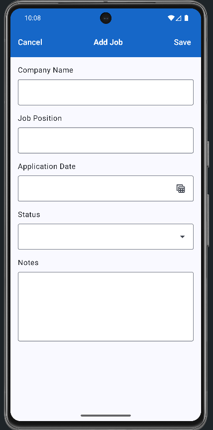

# Job Application Tracker 📱

Job Application Tracker is an Android application that helps users track their job applications in one place.  
Users can add, edit, delete, and filter job applications based on their current status.

---

## 🚀 Features
- Add, edit, and delete job applications
- Track application status (Applied, Interview, Rejected, Offer)
- Filter applications by status
- Offline data storage using Room database
- Clean and modern UI built with Jetpack Compose
- MVVM architecture

---

## 🛠 Tech Stack
- Kotlin
- Jetpack Compose
- MVVM Architecture
- Room Database
- Live Data
- Material Design 3

---

## 📸 Screenshots
### Job List


### Filter by Status


### Add Job


### Update the Job


---

## 🧠 Architecture
The app follows the MVVM (Model-View-ViewModel) architecture pattern to ensure a clean separation of concerns and maintainable codebase.

---

## 🏁 Getting Started
1. Clone the repository ```bash git clone https://github.com/USERNAME/JobApplicationTracker.git ```
2. Open the project in Android Studio
3. Run the app on an emulator or physical device


